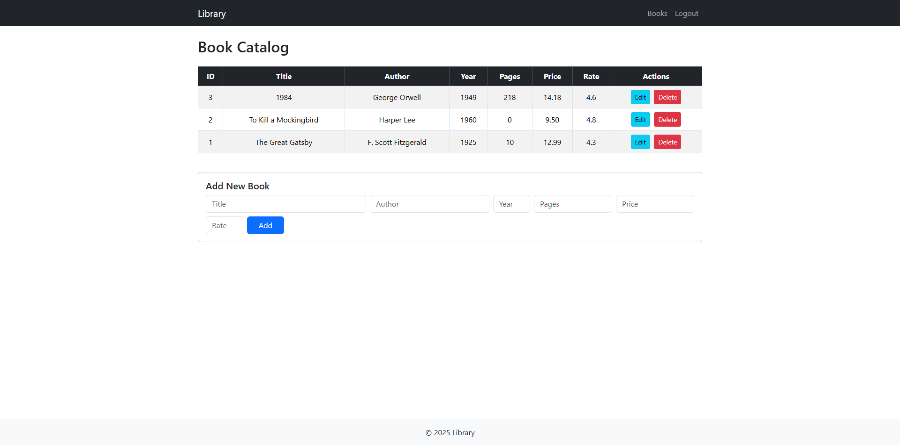
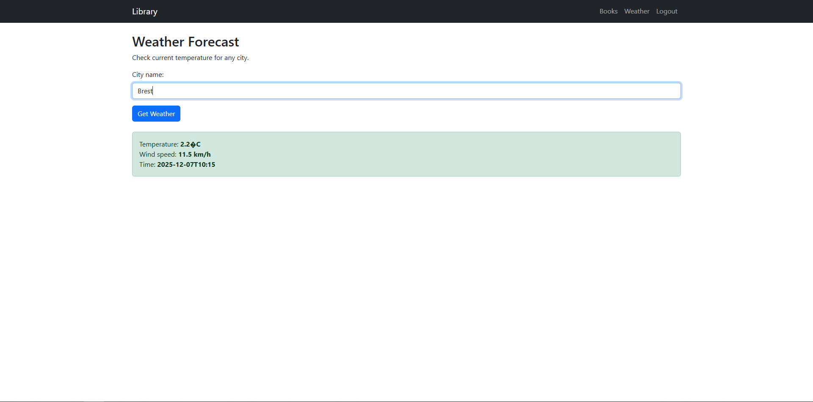

# Library — PHP + REST API + Bootstrap

https://libraryandweather.infinityfree.me/Library/public/home.php

## Quick start (XAMPP)
1. Change the root folder name to 'Library'
2. Copy the `Library` folder to `C:\xampp\htdocs\`.
2. Start Apache and MySQL in XAMPP.
3. Import `demo_data.txt` via phpMyAdmin (http://localhost/phpmyadmin).
4. Open in browser: `http://localhost/Library/public/home.php`

## Demo accounts
- admin / admin123 (role = admin)
- user / admin123 (role = user)

## API
- `GET /api/books.php` — list books
- `GET /api/books.php?id=1` — get book
- `POST /api/books.php` — add (admin)
- `PUT /api/books.php?id=1` — update (admin)
- `DELETE /api/books.php?id=1` — delete (admin)
- `POST /api/auth.php?action=login` — login (JSON body)
- `POST /api/auth.php?action=register` — register (JSON)
- `POST /api/auth.php?action=logout` — logout

